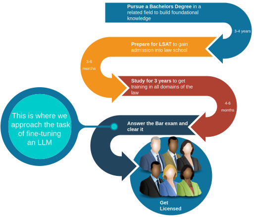

# The Idea
So at this point in my thesis, the only thing I know for certain is that I am supposed to **Fine-tune an open source LLM** for some **Law related purpose**.

*That was frustratingly ambiguous*. I dont really recall my thought process at the point, but the earliest thing I remember reading, and what my supervisors Noor and Andre recommended was the [GPT-4 Passes the bar](https://papers.ssrn.com/sol3/papers.cfm?abstract_id=4389233) paper. That kind of set the stage for what we would aim for. We now had found a well accepted publication that made waves about the zero shot capabilities of GPT-4 in answering the bar. We could build something on that premise.

## Deciding on the dataset and the task

I thought about it for a few days and it seemed like the bar exam would be a good thing for us to use as our testbed to check the capabilities of a fine-tuned model.
It is an objective examination, and is the last exam that an aspiring lawyer must attend to be licensed to practice.

### The structure of the Uniform Bar exam 

The Unified bar exam is actually divided into the following examinations.  

- Multistate Bar Examination (MBE) : Multiple-choice, single answer questions covering core legal topics.
- Multistate Essay Examination (MEE): Essay type response, based on legal scenarios
- Multistate Performance Test (MPT): Practical essay type, task based legal problem-solving exam.

For further details on the structure of the bar exam, you can visit the [NCBE website](https://www.ncbex.org/exams/ube/).

#### Pros of using the bar exam
- There is a large amount of study material and practice exams, in addition to extensive reddit communities that students use for practice -> relatively simple data collection
- Existing GPT-4 benchmark would be a good thing to compare against, since fine-tuning a model for the bar has not been done so far. 

#### The cons of using the Bar exam 
- The *MPT and MEE are open ended exams*, graded by expert lawyers, thus making it difficult for us to evaluate without hiring an expert (expensive and scaling issue).
- - The authors of the GPT-4 bar paper are actual lawyers, and thus it was a simple task for them to evaluate the results of the model on these open ended generation type exams. 
- - It would be difficult to do evaluations based on open ended generaton, and I was and still am not familiar enough with using an LLM as a judge, because from the literature survey I did it seemed to me that the Judge LLM would itself require extensive tweaking to ensure that it gave us what we needed without incoporating any unwanted biases.
- - An LLM as a judge is still a path I want to further explore in future work.

### The Verdict on task specification

We decided in the end to keep it simple, and use only the Multi-state Bar Exam (MBE) owing to its multiple choice, single answer format. This would give us a definitive evaluation strategy for our LLM that is already a well accepted paradigm ( used similarly in the [MMLU (Mulit-task Language Understanding)](https://huggingface.co/datasets/cais/mmlu) benchmark). This would give us a simple evaluation strategy of comparing the model's selected choice with the actual ground truth. 

## Deciding on the model - LLaMa-2 7B
The main caveat of the GPT-4 paper was that there was no way to confirm (other than the [technical report of GPT-4](https://arxiv.org/pdf/2303.08774)) that the bar exam was not included in the training data. The authors also do not mention which version of the model was used for the evaluation. 

We decided to use LLaMa-2 7B instead for the following reasons:

- It was an open-weight model.
- It had been used widely for fine-tuning tasks, and had a good track record of performance.
- The smaller size would make it easier for us to side-step the computational complexity involved with distributed training and inference issues. 
- Although we don't have the model training data info, we can still make an effective comparison by first evaluating a base instance of the model and then seeing whether fine-tuning improves the performance over this baseline.

A thing to note is that the pipeline we use for fine-tuning was made to be model agnostic, and one can, with just a few tweaks to the configs, use any model that is available on [Huggingface hub](https://huggingface.co/docs/hub/models-the-hub).

Im ofcourse glossing over a lot of the technical details here, but I'm sure someone has done a better job than I have at explaining it, and for the sake of brevity, I move on to the next part about the  [Data extraction and distillation](data_curation.qmd)